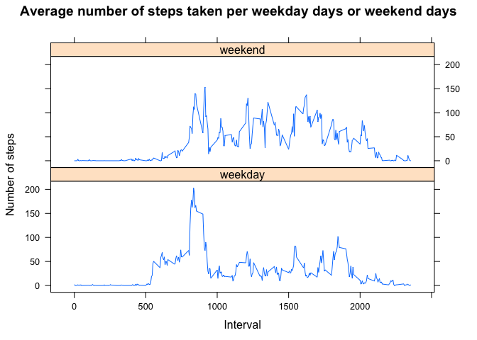

# Reproducible Research: Peer Assessment 1


## Loading and preprocessing the data


```r
activities = read.csv("~/work/R/coursera/repdata-012/RepData_PeerAssessment1/activity.csv")
str(activities)
```

```
## 'data.frame':	17568 obs. of  3 variables:
##  $ steps   : int  NA NA NA NA NA NA NA NA NA NA ...
##  $ date    : Factor w/ 61 levels "2012-10-01","2012-10-02",..: 1 1 1 1 1 1 1 1 1 1 ...
##  $ interval: int  0 5 10 15 20 25 30 35 40 45 ...
```

## What is mean total number of steps taken per day?


```r
df = activities[!is.na(activities$steps),]
any(is.na(df$steps))
```

```
## [1] FALSE
```

1. Total number of steps taken each day


```r
library(plyr)
t = ddply(df, "date", summarise, total.steps = sum(steps))
hist(t$total.steps, xlab = "No. of steps", 
     main = "Total number of steps taken each day")
```

 


2. Mean and median total number of steps taken per day

  -   mean


```r
mean(t$total.steps)
```

```
## [1] 10766.19
```
  -  median


```r
median(t$total.steps)
```

```
## [1] 10765
```


## What is the average daily activity pattern?
1.  A time series plot (i.e. type = "l") of the 5-minute interval (x-axis) and 
    the average number of steps taken, averaged across all days (y-axis)


```r
av = ddply(df, "interval", summarise, mean.steps = mean(steps))
plot(av$interval, av$mean.steps, type = "l",
     main = "Average number of steps taken, averaged across all days",
     xlab = "5-minute interval", ylab = "Average No. of steps")
```

 


2.  5-minute interval, on average across all the days in the dataset, that 
    contains the maximum number of steps


```r
av[av$mean.steps == max(av$mean.steps),]
```

```
##     interval mean.steps
## 104      835   206.1698
```


## Imputing missing values
1. The total number of missing values in the dataset (i.e. the total number of 
    rows with NAs)
    

```r
sum(is.na(activities$steps))
```

```
## [1] 2304
```

2.  Devise a strategy for filling in all of the missing values in the dataset. 
    For example, using *mean* for that day.
    

```r
# Fill in missing 'steps' values (NAs) with the mean for that day.
act_processed <- ddply(activities, "date", mutate, 
                       mean.steps = mean(steps, na.rm = TRUE),
                       new.steps = ifelse(is.na(mean.steps), 0, steps))

# It turn out that in the data set either a day has values for all intervals
# or NAs for all intervals. The command below will show this:
#       ddply(activities, "data", summarise, sum(is.na(steps)))

head(act_processed)
```

```
##   steps       date interval mean.steps new.steps
## 1    NA 2012-10-01        0        NaN         0
## 2    NA 2012-10-01        5        NaN         0
## 3    NA 2012-10-01       10        NaN         0
## 4    NA 2012-10-01       15        NaN         0
## 5    NA 2012-10-01       20        NaN         0
## 6    NA 2012-10-01       25        NaN         0
```

```r
act_processed[1000:1010,]
```

```
##      steps       date interval mean.steps new.steps
## 1000     0 2012-10-04     1115   42.06944         0
## 1001     0 2012-10-04     1120   42.06944         0
## 1002   180 2012-10-04     1125   42.06944       180
## 1003    21 2012-10-04     1130   42.06944        21
## 1004     0 2012-10-04     1135   42.06944         0
## 1005     0 2012-10-04     1140   42.06944         0
## 1006     0 2012-10-04     1145   42.06944         0
## 1007     0 2012-10-04     1150   42.06944         0
## 1008     0 2012-10-04     1155   42.06944         0
## 1009   160 2012-10-04     1200   42.06944       160
## 1010    79 2012-10-04     1205   42.06944        79
```

3.  Create a new dataset that is equal to the original dataset but with the 
    missing data filled in.


```r
activities_new <- activities
activities_new$steps <- act_processed$new.steps
```

4.  Make a histogram of the total number of steps taken each day and Calculate 
    and report the mean and median total number of steps taken per day.


```r
t <- ddply(activities_new, "date", summarise, total.steps = sum(steps))
hist(t$total.steps, xlab = "No. of steps", 
     main = "Total number of steps per day")
```

 

```r
mean(t$total.steps)
```

```
## [1] 9354.23
```

```r
median(t$total.steps)
```

```
## [1] 10395
```

-   Do these values differ from the estimates from the first part of the assignment? 
    +   Yes

-   What is the impact of imputing missing data on the estimates of the total 
    daily number of steps?
    +   The values of the mean and median total number of steps taken per day 
        callculated are lower because the missing data were filled with values. 
        Hence, this highlights the bias presence of missing data can introduce
        to a calculation.


## Are there differences in activity patterns between weekdays and weekends?

1.  Create a new factor variable in the dataset with two levels -- "weekday" 
    and "weekend" indicating whether a given date is a weekday or weekend day.
    

```r
days <- weekdays(as.Date(activities_new$date))
l <- days
l[l != "Saturday" & l != "Sunday"] <- "weekday"
l[l == "Saturday" | l == "Sunday"] <- "weekend"
activities_new <- cbind(activities_new, day_level = factor(l))
```


2.  Make a panel plot containing a time series plot (i.e. type = "l") of the 
    5-minute interval (x-axis) and the average number of steps taken, averaged 
    across all weekday days or weekend days (y-axis). 


```r
# Avg number of steps taken, averaged across all weekday days or weekend days
activities_avg <- ddply(activities_new, c("interval", "day_level"), summarise, avg.steps = mean(steps))

library(lattice)
xyplot(avg.steps ~ interval | day_level, data = activities_avg, layout = c(1,2),
       main = "Average number of steps taken per weekday days or weekend days",
       ylab = "Number of steps",
       xlab = "Interval",
       type = "l")
```

 
